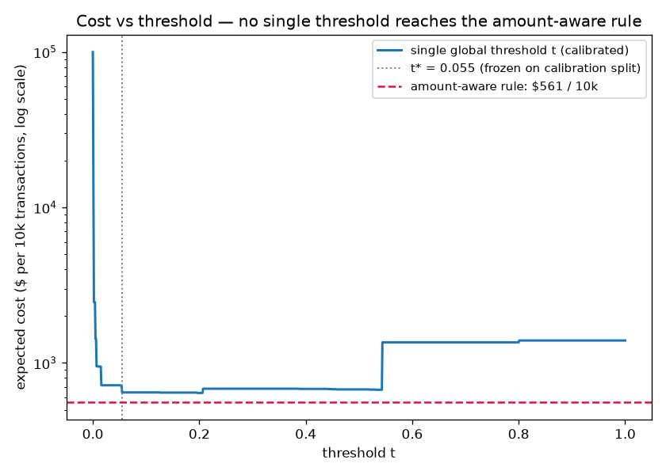

# fraudscore

A calibrated card-fraud scoring service that makes **expected-cost decisions** — review a
transaction when `p̂ × amount` exceeds the cost of reviewing it — served over FastAPI and
evaluated in **dollars with confidence intervals**, not in accuracy.

Most fraud tutorials end at a ROC curve. Real fraud systems answer a different question:
*is this transaction worth $10 of an analyst's time?* This project builds that decision
layer end-to-end: leak-free chronological evaluation, probability calibration, a
Bayes-optimal amount-aware decision rule, and every headline number bootstrapped.

## Results (test split, dollars per 10k transactions, 95% bootstrap CIs)

| policy | cost per 10k |
|---|---|
| **amount-aware rule (primary)** | **$561 [$189, $1,087]** |
| single global threshold t\* = 0.055 | $646 [$265, $1,178] |
| naive t = 0.5, uncalibrated | $972 [$445, $1,662] |
| approve everything (do-nothing floor) | $1,357 [$636, $2,255] |

- **Amount-aware vs the best single threshold: saves $84.87 [$20.08, $187.47] per 10k
  (13.1% [3.0%, 35.9%])** — the headline. A fitted global threshold is what most shops
  deploy; pricing each transaction individually beats the best one it could ever pick.
- Calibration alone is worth $94.32 [$36.87, $193.42] per 10k (14.4%) under the
  amount-aware rule. The rule multiplies p̂ by dollars, so a 2× miscalibration is a 2×
  mispricing of risk — calibration is load-bearing here, not cosmetic.
- The naive notebook policy (t = 0.5, uncalibrated) costs 73% more than the amount-aware
  rule.

All intervals: percentile bootstrap over test rows, B = 10,000, seeded. None of the
improvement CIs above includes zero. Full detail: [docs/eval-report.md](docs/eval-report.md).



*The signature chart: the curve is the best any single global threshold can do; the dashed
line is the amount-aware rule. No point on the curve reaches the line.*

### An honest finding: the baseline won

The design named gradient boosting as the main model. Under leak-free chronological
evaluation it lost to the plain logistic baseline — with only ~360 train frauds, the
boosted trees overfit the train time-window (PR-AUC 0.36 vs 0.64 on test; verified by
ablation, not a pipeline bug). The service therefore selects its champion by expected cost
on the calibration split ([ADR-002](docs/decisions.md)); both models ship in the eval
report permanently. A random split would have hidden this entirely — which is rather the
point of not using one.

## How it works

Cost matrix per transaction with amount *a*: approve legit = $0, review anything =
`c_review` ($10, [configurable](cost_params.yaml)), approve fraud = *a* (the charge-back).
The Bayes-optimal policy under this matrix needs no fitted threshold:

```
review  ⟺  p̂ · a ≥ c_review
```

Pipeline: chronological 60/20/20 split (train on the past, decide on the future — the
dataset spans ~2 days, so this is leakage avoidance, not a drift claim, and it costs a
little metric shine) → plain model fits (no resampling, **no class weights** — both distort
the base rate and poison calibration; imbalance is handled at the decision, in dollars) →
isotonic/sigmoid calibration selected by CV Brier on the calibration split → expected-cost
decisions.

## Quickstart

Requires [uv](https://docs.astral.sh/uv/) and a [Kaggle API token](https://www.kaggle.com/settings)
(`~/.kaggle/kaggle.json`) for the real dataset.

```bash
uv sync
uv run python scripts/fetch_data.py      # ULB creditcard dataset; verifies rows + SHA-256
uv run fraudscore train  --data data/raw/creditcard.csv --out artifacts
uv run fraudscore evaluate --data data/raw/creditcard.csv \
    --artifact artifacts/model.joblib --report docs/eval-report.md
uv run fraudscore serve                  # http://127.0.0.1:8000
```

Everything is seeded — `fetch → train → evaluate` reproduces `docs/eval-report.md`
bit-for-bit, bootstrap included. No Kaggle account? The full pipeline also runs on the
committed synthetic fixture (`--data data/fixtures/synthetic.csv`), which is what CI does;
real-data metrics live only in the committed report.

### Scoring

```bash
curl -s localhost:8000/score -H 'content-type: application/json' -d '{
  "amount": 149.62, "time": 40632.0,
  "v": [-1.36, -0.07, 2.54, 1.38, -0.34, 0.46, 0.24, 0.1, 0.36, 0.09, -0.55,
        -0.62, -0.99, -0.31, 1.47, -0.47, 0.21, 0.03, 0.4, 0.25, -0.02, 0.28,
        -0.11, 0.07, 0.13, -0.19, 0.13, -0.02]
}'
```

```json
{
  "fraud_probability": 0.0009,
  "expected_fraud_cost": 0.13,
  "decision": "approve",
  "decision_rule": "expected_cost",
  "c_review": 10.0,
  "model_version": "1.0.0",
  "scored_at": "2026-07-08T22:59:14Z"
}
```

Strict contract: extra fields, a V vector that isn't exactly 28 floats, negative or
non-finite values → 422 with field-level detail. `GET /health`, `GET /model-info` (the
model card, including the frozen t\*, so both decision rules are inspectable).

Measured latency, real artifact, uvicorn single worker on an M4 laptop:
**p50 2.1 ms, p95 2.4 ms, p99 2.8 ms** (250 sequential requests after warmup).

Batch: `uv run fraudscore score-batch in.csv --out scores.duckdb` appends to a DuckDB
`scores` table. Docker: `docker build -t fraudscore . && docker run -p 8000:8000
-v "$PWD/artifacts:/app/artifacts:ro" fraudscore`.

## Tests

`uv run pytest` — 63 tests: hand-computed toy cases for the decision rule and cost curve,
calibration ranking/selection properties, seeded-bootstrap determinism with hand-checkable
percentiles, API contract (including decisions flipping across the c_review break-even),
end-to-end pipeline on the fixture, and golden-metric regression pins (±1e-6). CI runs
ruff + the full suite on the synthetic fixture only.

## Limitations

- **Reviewed fraud is assumed always stopped** — the review fee is charged but the
  charge-back is fully avoided. That is optimistic about analyst performance.
- **Transactions under $10 are never reviewed** under the primary rule — even at p̂ = 1.
  Economically correct under this cost matrix, and unsafe against fraud rings that split
  charges without velocity logic on top (roadmap).
- **`cycle_phase` is not time-of-day.** `Time` is seconds since the dataset's first
  transaction, so the feature is phase within a 24-hour cycle relative to dataset start —
  it can capture daily periodicity, nothing more.
- **Anonymized PCA features** (V1–V28) limit any feature-engineering claims; the
  contribution here is the calibration + decision layer, which transfers to real feature
  stacks.

## Roadmap

- Velocity / fraud-ring features to close the small-transaction hole
- Test the no-resampling claim: SMOTE and class-weight variants, scored in expected cost
  (hypothesis: they don't win)
- Per-segment `c_review` (review cost is not one number in practice)

## License

[MIT](LICENSE)
