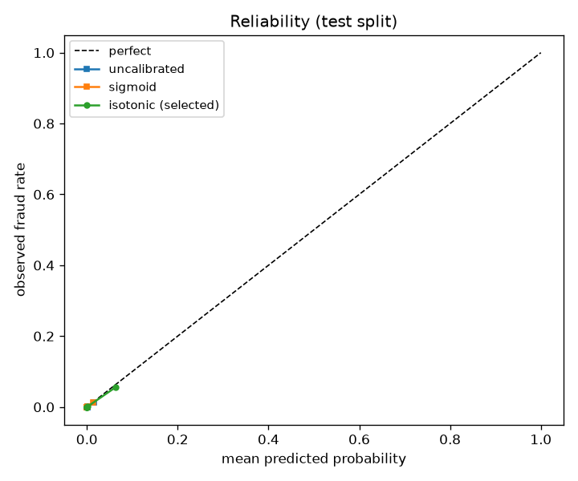

# Evaluation report

Generated by `fraudscore evaluate`; seeded end-to-end, so a rerun reproduces this
file bit-for-bit. All intervals are bootstrap 95% CIs (B = 10,000, seed = 42, percentile), format `point [low, high]`.

## Data card

Chronological split (train on the past, decide on the future — leakage avoidance).

| split | rows | frauds | base rate | Time range (s) |
|---|---|---|---|---|
| train | 170,884 | 360 | 0.2107% | 0 – 120,396 |
| calibration | 56,961 | 57 | 0.1001% | 120,396 – 145,247 |
| test | 56,962 | 75 | 0.1317% | 145,248 – 172,792 |

## Models under comparison

Champion (served, headlines below): **logistic** — selected by amount-aware expected cost on the calibration split only (see decisions.md ADR-002). Challenger: gradient boosting. Both stay in this report permanently.

| model | PR-AUC | ROC-AUC¹ | Brier |
|---|---|---|---|
| champion: logistic (calibrated, isotonic) | 0.6362 | 0.9732 | 0.000663 |
| champion: logistic (uncalibrated) | 0.6982 | 0.9738 | 0.000667 |
| challenger: gradient boosting (calibrated, isotonic) | 0.3634 | 0.8055 | 0.000904 |

¹ ROC-AUC is inflated under heavy class imbalance; PR-AUC is the primary metric.

## Calibration (champion)

Selected method: **isotonic** (lower Brier under 5-fold CV within the calibration split; tie broken by reliability fit in the p < 0.1 region).

| method | CV Brier (calibration split) | p < 0.1 reliability error |
|---|---|---|
| sigmoid | 0.000622 | 0.000076 |
| isotonic | 0.000599 | 0.000103 |

## Decision policy costs (test split, $ per 10k transactions)

Cost matrix: review costs $10.00 (fraud or not); approved fraud costs its amount; approved legit is free.

| policy | cost per 10k |
|---|---|
| amount-aware, calibrated champion (primary) | $561.39 [$188.66, $1,086.94] |
| single threshold t* = 0.055, calibrated champion | $646.27 [$264.70, $1,177.70] |
| naive t = 0.5, uncalibrated champion | $972.46 [$445.14, $1,662.48] |
| amount-aware, uncalibrated champion | $655.71 [$274.20, $1,190.19] |
| amount-aware, calibrated challenger (gradient boosting) | $584.14 [$207.96, $1,116.94] |
| approve all (do-nothing floor) | $1,356.92 [$636.32, $2,254.81] |

### The four comparisons

1. **Amount-aware vs single threshold t\*** (both calibrated) — the headline
   Savings: $84.87 [$20.08, $187.47] per 10k (13.1% [3.0%, 35.9%]).

2. **t\* vs naive t = 0.5 on the uncalibrated model** — what a notebook would ship
   Savings: $326.19 [$27.03, $774.40] per 10k (33.5% [4.0%, 63.7%]).

3. **Calibrated vs uncalibrated under the amount-aware rule** — what calibration buys in dollars
   Savings: $94.32 [$36.87, $193.42] per 10k (14.4% [4.8%, 37.7%]).

4. **Amount-aware vs approve-all** — distance from the do-nothing floor
   Savings: $795.52 [$238.33, $1,560.62] per 10k (58.6% [27.0%, 83.2%]).

## Signature chart

The curve is the best any single global threshold can do on the test split; the dashed line is the amount-aware rule. The gap between the curve's minimum and the line is the value of pricing each transaction individually.

## Confusion matrices (test split)

### At t\* = 0.055 (calibrated)

|  | predicted approve | predicted review |
|---|---|---|
| **legit** | 56,849 (TN) | 38 (FP) |
| **fraud** | 20 (FN) | 55 (TP) |

### Amount-aware rule (review ⟺ p̂ · amount ≥ $10)

|  | predicted approve | predicted review |
|---|---|---|
| **legit** | 56,845 (TN) | 42 (FP) |
| **fraud** | 56 (FN) | 19 (TP) |

Note: under the amount-aware rule a 'FN' can be economically correct — a small fraud not worth a review. The dollar tables above, not raw counts, are the measure of the policy.
